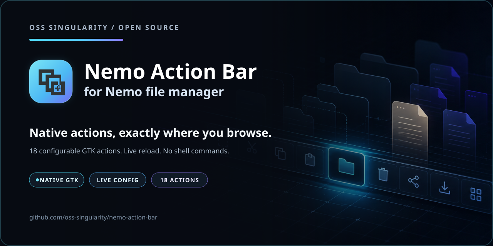

<h1 align="center">Nemo Action Bar</h1>

<p align="center">
  A fast, configurable GTK power bar with 18 native Nemo file-manager actions.
</p>

<p align="center">
  <a href="https://github.com/ClaudiuSchuster/nemo-action-bar/actions/workflows/check.yml"></a>
  <a href="https://github.com/oss-singularity/nemo-action-bar/releases/latest"></a>
  <a href="LICENSE"></a>
  
  
</p>

<p align="center">
  
</p>

<p align="center"><sub>18 native Nemo actions, one focused bar, and a faster path through every folder.</sub></p>

The current default layout in a real Nemo window, together with Nemo's original
toolbar and the [active-window highlight](https://github.com/ClaudiuSchuster/cinnamon-active-window-highlight):


## What it provides

- 18 direct actions for folders, clipboard operations, undo/redo, selection,
  views, paths, terminal/admin access, favorites, archives and the trash.
- 14 useful buttons enabled by default; powerful or situational actions remain
  one JSON switch away.
- Live configuration reload in open Nemo windows.
- Native Nemo actions, selection rules, dialogs and file operations.
- Theme-compatible GTK icons and a compact layout that stays out of the way.

All 18 available actions enabled:


The complete layout in a real Nemo window, together with Nemo's original
toolbar and the [active-window highlight](https://github.com/ClaudiuSchuster/cinnamon-active-window-highlight):


Nemo does not expose a public hook for third-party buttons in its built-in
toolbar. This extension therefore uses Nemo's supported Python
`LocationWidgetProvider` interface and places a native GTK bar immediately
above the directory view. Each button activates an allowlisted Nemo `GtkAction`
or a known keyboard accelerator. File selection, capability checks,
confirmation dialogs and file operations therefore remain under Nemo's
control. No configurable shell commands are executed.

The bar is intentionally omitted from Nemo's desktop surface. Opening the
actual Desktop folder in a regular Nemo window still shows it normally.

## Requirements and installation

- Nemo 5 or newer
- `nemo-python`
- GTK 3 Python introspection bindings
- Optional: `nemo-fileroller` for **Create archive** and **Extract here**

```bash
git clone https://github.com/ClaudiuSchuster/nemo-action-bar.git
cd nemo-action-bar
./install.sh
```

Then close every Nemo window and start Nemo again. Existing user configuration
is preserved during updates. To install a later version, run `git pull` in the
checkout followed by `./install.sh` again.

## Configuration

The default configuration is installed only when
`~/.config/nemo-action-bar/buttons.json` does not yet exist. Valid changes are
picked up live by open Nemo windows. A button consists of an ID, a label, an
installed GTK icon name and one of the supported action IDs:

```json
{
  "id": "duplicate",
  "label": "Duplicate",
  "icon": "nemo-action-bar-duplicate-symbolic",
  "action": "duplicate"
}
```

English is the default language for labels and runtime messages. Labels remain
plain configuration values, so a personal `buttons.json` can translate or
rename them without changing the extension.

Use `{ "type": "separator" }` for a separator or `"enabled": false` to hide
an entry temporarily. Shortcut-only entries from earlier releases remain
supported; their `shortcut` must be a valid GTK accelerator. Arbitrary command
lines are intentionally not supported.

### Supported actions

| Action ID                      | Behavior                                                            |
| ------------------------------ | ------------------------------------------------------------------- |
| `new-folder`                   | Create and immediately name a folder                                |
| `cut`, `copy`, `paste`         | Nemo's native clipboard operations                                  |
| `duplicate`, `rename`, `trash` | Operate on the current selection                                    |
| `undo`, `redo`                 | Nemo's file-operation history                                       |
| `properties`, `select-all`     | Properties or full selection                                        |
| `show-hidden`                  | Toggle hidden files for the current window                          |
| `copy-path`                    | Put selected local paths/URIs on the clipboard as plain text        |
| `open-terminal`                | Open Nemo's configured terminal at the selected/current folder      |
| `open-admin`                   | Use Nemo's built-in “Open as Root” action and authentication dialog |
| `favorite-toggle`              | Add or remove the selection according to its current state          |
| `archive-create`               | Open File Roller's archive-creation dialog (`nemo-fileroller`)      |
| `archive-extract`              | Extract the selected supported archive here (`nemo-fileroller`)     |

The shipped `open-admin`, `favorite-toggle`, `archive-create` and
`archive-extract` entries use `"enabled": false`. Change the desired values to
`true` in your personal JSON to show those buttons without restarting Nemo.

The screenshots deliberately show the complete layout with all available
actions. Copy `buttons.json` from the repository over your personal
configuration if you want to adopt the current defaults after an update.

## Uninstall

Run `./uninstall.sh`. The user configuration is deliberately retained and can
be removed separately if it is no longer needed. Restart Nemo afterwards.

## Development

```bash
make check
```

The checks compile the Python extension, validate the shipped and fallback
button configurations, parse JSON and run ShellCheck. Every push and pull
request runs the same validation in GitHub Actions.

## Cinnamon Spices status

This project is a Nemo Python UI extension, not a Cinnamon desktop extension
and not a declarative Nemo context-menu Action. It therefore does not fit the
Cinnamon Extensions or Cinnamon Actions download categories in their current
form. Community distribution can use this repository, a distro package, or an
upstream proposal to Nemo/nemo-extensions.

Licensed under GPL-2.0-or-later. See `LICENSE`.
